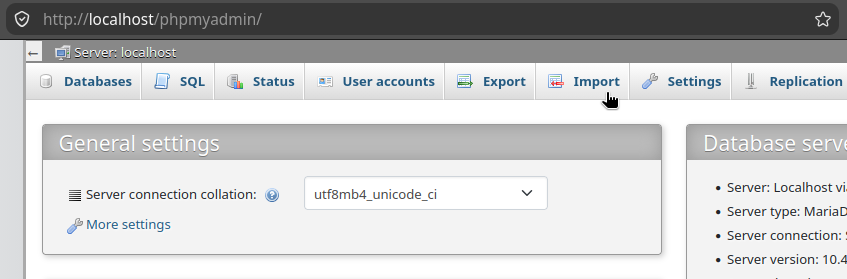
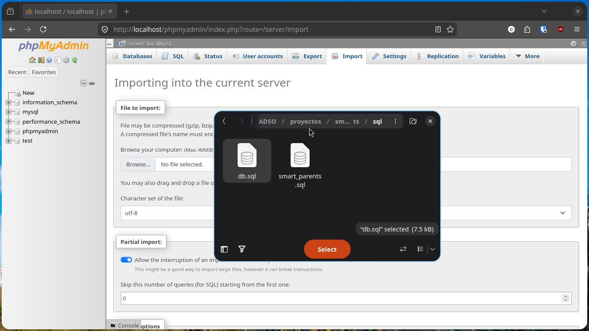
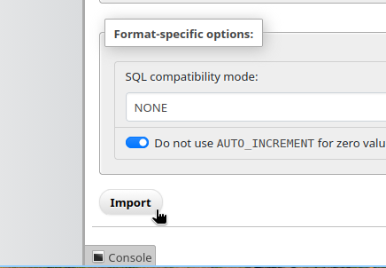
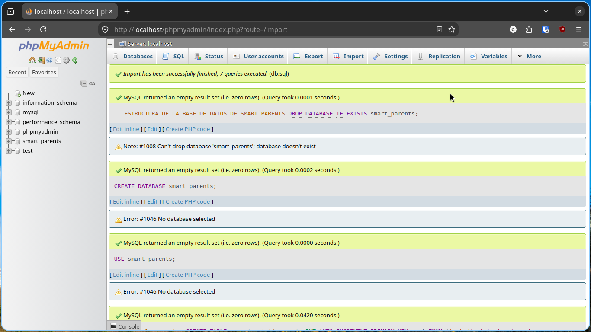
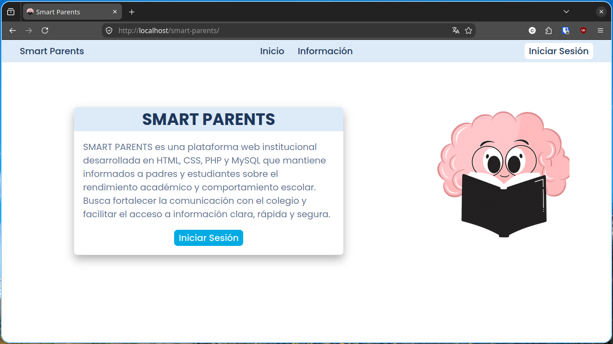
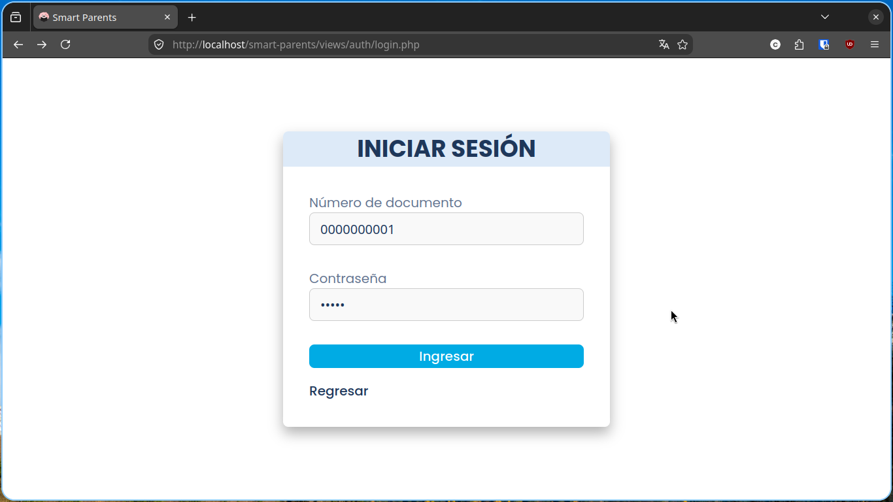
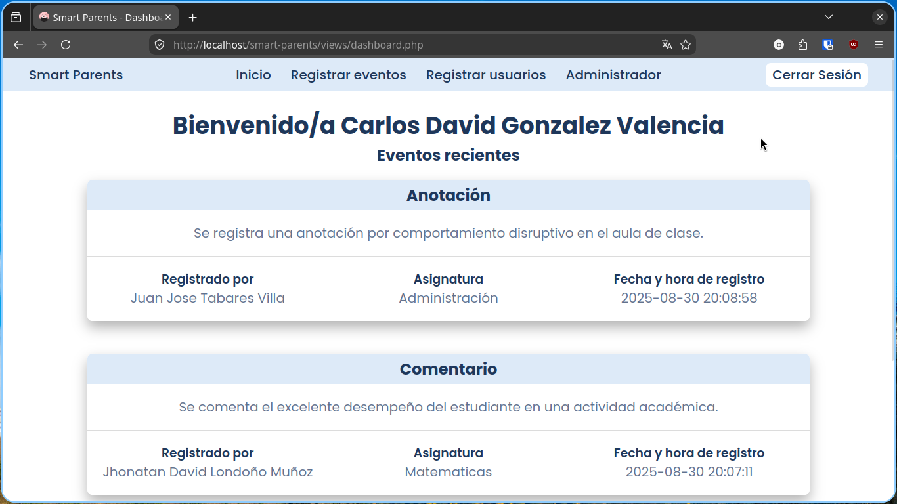

# Smart Parents


Smarts Parents es una plataforma web institucional desarrollada en HTML, CSS, PHP y MySQL que mantiene informados a padres y estudiantes sobre el rendimiento académico y comportamiento escolar. Busca fortalecer la comunicación con el colegio y facilitar el acceso a información clara, rápida y segura.

>[!TIP]
> Este fue el proyecto de grado del programa de formación **Técnico en Programación de Software** con el sena - 2025.

## Requisitos
Para instalar y ejecutar el software de manera **local** debes de tener [XAMPP](https://www.apachefriends.org/es/index.html) instalado en el equipo. Recomiendo instalar y usar la version **8.2.12**.

## Instalación
Para una correcta instalación debes de seguir los siguientes pasos:

### 1. Clonar el repositorio
```sh
git clone https://github.com/karloz-1/smart-parents.git
```

### 2. Mover la carpeta `smart-parents` al directorio `htdocs`

**Windows:** `C:\xampp\htdocs`\
**GNU/Linux:** `/opt/lampp/htdocs/`\
**MacOS:** `/Applications/XAMPP/htdocs` o `XAMPP/xamppfiles/htdocs`

### 3. Crear la base de datos
>[!WARNING] IMPORTANTE
> Para este paso debes de tener previamente iniciado **XAMPP**

**1. Ingresar a [phpMyAdmin](http://localhost/phpmyadmin/)** y entrar al modulo `Import`



**2. Seleccionar el archivo `./sql/db.sql`**



**3. Presionar el botón `Import`**



Si todo salió bien debería de aparecer tarjetas con mensajes de éxito y colores verdes. Además de mostrarse el nombre `smart_parents` en la parte izquierda



## Uso
>[!WARNING] IMPORTANTE
> Para usar el software de manera local debes de tener **XAMPP** en ejecución
### 1. Ingresar a [Smart Parents](http://localhost/smart-parents/)



### 2. Iniciar sesión
>[!TIP] NOTA
> Por diseño no podrás crear una cuenta desde el segundo uno, pero si ingresas a un perfil de administrador podrás crear usuarios.

Para iniciar sesión debes de ingresar algunas de las [credenciales](http://localhost/smart-parents/views/public/informacion.php) proporcionadas



### 3. Explorar

